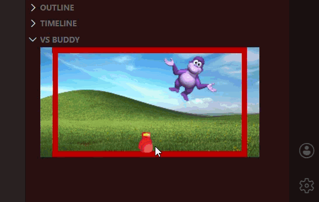

# VS Buddy

An extension for VS Code that allows you to relieve stress when something goes wrong by beating up your own little buddy. Inspired by the hit 2004 Flash game "Interactive Buddy"!

## Features

VS Buddy is a physics-based sandbox where you interact with a reactive character by using your cursor to grab, throw, or punch the entity with a fist for immediate stress relief.

## Known Issues

- Canvas does not resize with panel
- It is relatively easy to bump the buddy outside of the walls
- Buddy does not respawn once outside of intended bounds
- Loading is somewhat slow
